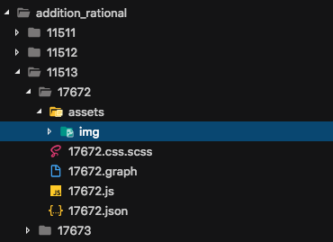

Структура карточки
===

Авторы: [Георгий Грошев](https://github.com/eclegend), [Илья Назаров](https://github.com/ilich-x)

# Содержание
  * [Общая структура](#Общая-структура)
    * [Карточка](#Карточка)
    * [Чанк](#Чанк)
---
  * [_card.json](#_cardjson)
  * [.json](#json)
  * [.graph](#graph)
  * [.graph && .js](#graph--js)
  * [.js && .css.scss](#js--cssscss)
  * [.css.scss](#cssscss)
---
  * [this.tutor](#this.tutor)
  * [Дополнительная информация](#Дополнительная-информация)

# Общая структура

## Карточка
Карточка - это индивидуальная самостоятельная единица контента. Карточка может считаться отдельным небольшим модулем, в котором есть входные данные (значения генерации) и свои подмодули (чанки). В карточке (интерактивном уроке) отрабатывается одна задача на одну тему.

Карточка в cms имеет свой уникальный идентификатор, например, карточка [1140](https://cms.uchi.ru/ru/cards/1140?sound=on_demand&version=189836).

## Чанк
Чанк (от англ. chunk) - отдельная часть карточки. Карточка может состоять из 1 чанка, а может состоять из 4 (и более) чанков. В одном чанке может реализовываться новый способ решения задачи, отсутствуют подсказки, некоторые инпуты и т.д., отрабатываться новые генерации и т.п.

Чанки могут быть почти идентичны, а могут и кардинально отличаться.

Для каждого чанка создается **отдельный** скрипт и файл стилей.

Если чанки идентичны и отличаются только набором генераций, то допустимо оставить один скрипт.

Карточка состоит из 5 основных файлов:

1. `<номер карточки>_card.json`
2. `<номер скрипта>.json`
3. `<номер скрипта>.js.`
4. `<номер скрипта>.graph`
5. `<номер скрипта>.css.scss`

Обычно к моменту разработки они уже сгенерированы и находятся в папке проекта по определенным путям.

Структура:

```d
content-{имя_проекта}/
├── cards/{класс}/{название_урока}/<номер_карточки>_card.json // json файлы карточек
└── src/{класс}/{номер_карточки}/{номер_скрипта} // основная папка разработчика контента
          ├── assets/ // изображения, графовые мискины, хелперы для карточек (при необходимости)
          ├── <номер_скрипта>.json // json скрипта
          ├── <номер_скрипта>.js // скрипт
          └── <номер_скрипта>.css.scss // файл стилей скрипта
```

# _card.json
`<номер карточки>_card.json` - файл содержит имя карточки, чанки, генерации, ссылки на скрипты по чанкам и др.

```javascript
// 11533_card.json
{
  "name_ru": "temp",
  "player": "/players/player-1",
  "supports": {
    "sound": "v2",
    "beads": "v4", // версия бусин
    "interbeads_congrat": "v1"
  },
  "progress": "beads", // прогресс измеряется в бусинах
  "chunks": [
    {
      "script": 17672, // номер скрипта
      "amount": 1, // количество бусин необходмое для прохождения чанка (при правильном ответе бусина перекатывается направо)
      "strategy": "stack", // стратегия по которой осуществляется переход к следующей генерации
      // "stack" - выглядит как массив объектов
      "generations": [
        {"expr": "4+5"},
        {"expr": "3+8"}
      ]
    },
    {
      "script": 17673,
      "amount": 1,
      "strategy": "stack_adaptive", 
      "stack_adaptive_beads": 1, // необязательный параметр
      "generations": {
        "stack": [
          "1",
          "2"
        ],
        "values": {
          "1":[
            {}
          ],
          "2":[
            {}
          ]
        }
      },
      "without_penalty": true // необязательный параметр делает бусину при ошибке неоткатной (по договоренности с методистом) по умолчанию false
    },
    ...
  ],
  "compiler_deps_version": "v4"
}
```

[Все возможные стратегии](https://uchiru2.atlassian.net/wiki/spaces/uchi/pages/1376953):
```json
{
  "strategy": "stack",
  "strategy": "stack_adaptive",
  "strategy": "stack_adaptive_with_variations",
  "strategy": "strategy_fix_mistakes",
  "strategy": "shuffle",
  "strategy": "increasing_stack"
}
```

# .json

`<номер скрипта>.json` - в этом файле описываются параметры скрипта, подключение необходимых компонент, библиотек и прочего. А также текстовые контанты (текст хинтов, текстовые сообщения и др.)

```javascript
// файл 12662.json
{
  "name": "17672",
  "require": [ // сюда подключаеются необходимые компоненты
    "/components/system/kernel/30.0.0",
    "/components/system/scene/7.1.0",
    "/components/system/atoms-core/0.1.0",
    "/components/system/button/17.1.1",
    "/{пути_для_кастомных_библиотек_либо_ваших_файлов}",
    "17672.graph", // файл графа
    "17672.js", // наш файл js
    "17672.css" // файл стилей
  ],
  "const": { // Описание некоторых языковых констант (текст на кнопках, хинтах и т. п.)
    "title": {
      "ru": { // локаль, в данном случае русская
        "text": "ЗАГОЛОВОК",
        "audio": {
          "mp3": "/{путь_до_аудио}/121.mp3" // озвучка
        }
      },
      "en": {
        // Английские константы самостоятельно не нужно заполнять
      }
    },
    "done": {
      "ru": {
        "text": "Готово"
      }
    }
  },
  "supports": {
     "speaker": "v5", // подключение спикера в карточках с озвучкой
    "resources": "v2",
    "keypad": "v3", // версия виртуальной клавиатуры в разных проектах может отличаться
    "graph": {
      "state": "v2",
      "multitype": true
    }
  }
}
```
Файлы изображений, например, должны храниться в папке `assets/img` рядом с вашей каточкой.



И тогда `"/{пути_для_кастомных_библиотек_либо_ваших_файлов}",` будет выглядеть как `"assets/img",`.


# .graph
За логику скрипта отвечает программа на языке описания UchiGraph. Основная идея состоит в том, что любой сценарий можно реализовать с помощью небольших шагов с ветвлениями-условиями и форками (когда несколько шагов выполняются одновременно). Примерами шагов являются элементы сценария, такие как выполнение анимации, проверка ответа, перетаскивание драгательного объекта, показ хинта и так далее.

```
# комментарий
script_17676-->
init-->
render-->
start-->
continue-->
click(clickOnBird|.bird)-->
deinit-->
the_end();
```
Базовыми элементами языка являются шаги и связи. Программа на UchiGraph состоит из инструкций, разделенных точкой с запятой `;`.

Название шага должно соответсвовать его смысловому содержанию.
Функция должна делать только то, что явно подразумевается её названием. И это должно быть одно действие.
Если оно сложное и подразумевает поддействия – может быть имеет смысл выделить их в отдельные функции. Зачастую это имеет смысл, чтобы лучше структурировать код.

<<<<<<< HEAD
Название шага должно соответствовать ???.
=======
В `UchiGraph` предусмотренно подобное поведение. Можно писать подграфы или графовые миксины:
>>>>>>> examples

```
script_17676-->
init-->
render-->
start-->
continue-->
taskClick-->
include(life)--> // графовый миксин, закончив выполнение, перейдет к следущему шагу
delay(1000)--> // задержка в миллисекундах
deinit-->
the_end();

taskClick = {
  initClick-->
  checkClick-->
  ...
  next(); // вернет к taskClick--> и перейдет к следущему шагу
};

```


# .graph && .js

Файл `.js` в нашем случае тесно связан и с графом (`.graph`). Граф проходится по методам и вызывает их, когда нам нужно. Можно заранее описать структуру чанка в файле графа, затем запустить в консоле скрипт `./update_script `

Заранее сгененрированный файл `.graph` выглядит примерно так:
```
script_17676-->
init-->
render-->
start-->
continue-->
deinit-->
the_end();
```

* [Шаг `init`. Инициализация](#Шаг-init-Инициализация)
* [Шаг `render`. Рендеринг](#Шаг-render-Рендеринг)
* [Шаг `start`. Начало](#Шаг-start-Начало)
* [Шаг `continue`. Продолжение](#Шаг-continue-Продолжение)
* [Шаг `deinit`. Окончание](#Шаг-deinit-Окончание)
* [Работа с графом](#Работа-с-графом)


Вот так выглядит сгенерированный файл `17676.graph`. Номер скрипта может быть любым. В данном случае это `17676`. Самая первая строчка `script_17676-->` очень важна и не стоит ее удалять.

---
## Шаг `init`. Инициализация

Все инстансы и `jQuery-элементы` создаются в шаге `init`.

Отделяем инстансы компонентов от `jQuery`-элементов. Записываем все инстансы компонентов в переменную `this.com`, а `jQuery`-элементы в `this.dom`. Так нам всегда будет видно в коде, к какой именно сущности мы обращаемся.

Можно разделять инициализацию на несколько шагов, если это вам нужно, но все их названия должны начинаться с `init...` и находиться до шага `render`.

Иногда для некоторых компонентов и методов (`this.tutor.speaker()`, `$$.Dragger()`) требуется наличие в DOM-е передаваемых им элементов в отрендеренном состоянии для рассчета их позиций (что не очень хорошо), поэтому создание этих элементов может происходить в других шагах после шага `render` или в самом шаге `render`.

Переменная `this.salt` хранит в себе генерации из файла `_card.json`.
```javascript
// init
$$.Script.prototype.init = function (cb) {
  // Генерации
  this.props = { ...this.salt };
  // Components
  this.com = {
    button: new $$.Button({
      content: this.tutor.t('done')
    })
  };
  // DOM
  this.dom = {
    button: this.com.button.view,
    buttonContainer: $.div('button-container'),
    scene: $.div('scene'),
    title: $.div('title')
      .html(this.tutor.t('title'))
  };
  cb();
};

```
---
## Шаг `render`. Рендеринг
Групповой рендер элементов в `DOM`. Так как `DOM` в браузере достаточно медленная структура, то лучше пореже обращаться к ней. Хоть для нас и не очень важна пока что производительность, но лучше привыкать к этому сразу.

Почти весь рендер (большая часть) должен происходить в шаге `render`. Можно разделять рендер на несколько шагов, если это вам нужно, но все их названия должны начинаться с `render...`. Например, если нужна инициализация каких-то компонентов, требующих уже отрендеренных компонентов.

Плюс, если мы будем рендерить все первые элементы все разом в шаге `render`, то у нас будет перед глазами наглядная структура того, что у нас есть в `DOM`-е на данный момент.

```javascript
// render
$$.Script.prototype.render = function(cb) {
  // Scene
  this.place.append(
    this.dom.scene.append(
      this.dom.title,
      this.dom.buttonContainer.append(
        this.dom.button
      )
    )
  );
  cb();
};
```
---
## Шаг `start`. Начало
Здесь мы только отображаем нашу кнопку play_button и слушаем нажатие.

```javascript
// start
$$.Script.prototype.start = function(cb) {
  this.tutor.play_button(cb);
};
```
---
## Шаг `continue`. Продолжение
Этот шаг вспомогательный. Сюда мы возвращаемся каждый раз, если у нас есть какие-то циклические повторения (экраны, fork-и, проверки). Здесь же мы сбрасываем состояние нашего скрипта, если нужно (`this.state.action`, `this.state.error`).

```javascript
// continue
$$.Script.prototype.continue = function(cb) {
  this.state.action = null;
  this.state.error = false;
  cb();
};
```

## Шаг `deinit`. Окончание
Здесь мы очищаем нашу сцену и снимаем обработчики событий с других элементов, если нужно.

```javascript
// deinit
$$.Script.prototype.deinit = function(cb) {
  $$.scene__clear(this.dom.scene);
  cb();
};
```
## Работа с графом
Теперь можно дополнять граф, исходя из поставленных целей.
При загрузке чанка в браузере мы увидим кнопку `play_button`, которая вызывается в методе `start-->`, а значит все `шаги` до этого уже выполнились.

---
**`this.tutor.play_button()` - может отличаться в зависимости от проекта**


---
```
script_17676-->
init-->
render-->
start-->
continue-->
...// сюда, например, можно добавлять свои методы
deinit-->
the_end();
```

Для работы с паралельными шагами в UchiGraph есть функции: `fork/join`. `fork(n)` полностью клонирует состояние скрипта (все this-переменные), где `n` - произвольное уникальное число, идентификатор форка. Форки могут быть вложенными, можно вызывать fork столько раз сколько нужно, каждый раз производя клонированное состояние. `join(n)` заканчивает все разветвления, созданные `fork(n)` принудительно (это будет объяснено ниже более подробно).


>**`Важно!` В шаге нельзя делать ничего после вызова колбека cb.**

### Системные вызовы

Часть узлов может быть представлена системными вызовами. Это тоже микрошаги, отличие в том, что имплементировать их не нужно.

`delay(n)` - пауза на `n` миллисекунд. Например `delay(3000)` - задержка в `3` секунды.

`read_input(...)` - метод ожидания нажатия на клавиатуру. Аргументы - типы нажатий, которые слушаем, совпадают с аналогичным параметром в методе `this.tutor.keypad_start`.

`click(...)` - ожидает клика на объект/объекты. Объекты должны быть jquery-объектами или массивами `jquery`-объектов. Метод устанавливает переменную `this.obj` с объектом, на котором произошел клик.

Клик автоматически устанавлиет курсор в указатель над всеми объектами и вешает класс `clickable`.

`drag/drag_x/drag_y(...)` - драг на объекты. Параметры - `jQuery`-объект или массив `jquery` - объектов. Чтобы драг заработал, необходимо реализовать в скрипте метод `<полное имя шага>_on_move`, который будет возвращать объект с обязательным ключом `slot`. Возможны 2 вида ключа `slot` - число или `jQuery` объект. Драг устанавливает переменные `this.obj` и `this.slot`. Чтобы дотянуть объект до слота нужно сделать шаг вручную. Работу с драгом можно посмотреть в [демо-карточке](https://cms.uchi.ru/ru/cards/10963?chunk=2&show_gens_descs=true&sound=on_demand&value_index=2&version=189836).


Вот пример как может быть:

```
init-->
render-->
start-->
continue-->

fork(1)--> // запуск параллельных процессов (драг)
  drag(drag|.plate)-->
    animateAfterDrag-->
    join(1); // переход в join
fork(1)--> // запуск параллельных процессов (клик)
  click(cl1|dom.button)-->
    join(1); // переход в join

join(1)-->
// проверяем, что произошло
  checkAction-[click]-> // клик по кнопке 'готово'
    checkDrag-[wrong:err]-> // проверяем ответ, ':err' - делает ошибку (откат бусины)
      hightlight--> // какая-то реакция на ошибку
      fork(1); // возврат к драгу и клику
    checkDrag-[right]->
      animateScene-->
      delay(1000)--> // метод графа
      deinit;
  checkAction-[drag]->
    fork(1);
deinit-->
the_end(); // метод графа
```

```javascript
// checkAction
$$.Script.prototype.checkAction = function(cb) {
  cb($(this.obj).hasClass('.button-basic') ? 'click' : 'drag');
};
// checkDrag
$$.Script.prototype.checkDrag = function(cb) {
  let answer = false;
  if (...) {
    answer = true;
  }
  cb(answer ? 'right' : 'wrong');
};
```

В `cb()` можно передавать любые строки, что позволяет сократить код.

```javascript
// checkDrag
$$.Script.prototype.checkDrag = function(cb) {
  let answer = false;
  if (...) {
    answer = true;
  }
  cb(String(answer));
};
```

Тогда в графе это должно быть так:

```
checkDrag-[false:err]->
  ...
checkDrag-[true]->
  ...
```

```javascript
// пример _on_move
// drag
$$.Script.prototype.drag_auto_on_move = function (obj, mode) {
  this.com.dragger.drag(obj, mode);
  return { slot: 0 };
};
```


# .js && .css.scss

Ранее мы договаривались, что стиль регистра будет везде `CamelCase`, в `.scss` лучше использовать `spinal-case`.

```javascript
// js
this.dom = {
  scene: $.div('scene'),
  redBlock: $.div('red-block'), // переменная записана в camalCase, а класс spinal-case
}
```

```scss
// .css.scss
& {
  .red-block {
    position: absolute;
    top: 10px;
    left: 124px;
    opacity: 1;
  }
}
```

---

```javascript
// js
this.dom = {
  scene: $.div('scene'),
  redBlock: $.div('red-block'), // переменная записана в camalCase, а класс spinal-case
  miniRedBlocks: _.range(5).map(i=> $.div(`mini-red-block-${i}`)),
};
// ...
this.place.append(
  this.dom.scene.append(
    this.dom.redBlock.append(
      ...this.dom.miniRedBlocks
    ),
  )
);
```

```scss
// .css.scss
& {
  .red-block {
    position: absolute;
    ...
    .mini-red-block {
      &-0 {
        ...
      }
      &-1 {
        ...
      }
    }
  }
}
```

# .css.scss

Все `scss` файлы у нас называются `.css.scss` и выглядит он вот так: 

```scss
// .css.scss
& {
  // тут добавляем миксины компонентов, если нужно и пишем наши стили
}
```

Пример:
---

```json
// .json
"require": [
    "/components/system/kernel/30.0.0",
    "/components/system/scene/7.1.0",
    "/components/system/atoms-core/0.1.0",
    "/components/system/button/17.1.1",
    "/components/system/inputs/17.0.1",
    ...
]
```

Вместо `url('')` для картинок мы используем функцию `ASSET_PATH('')`, это нужно для компилятора.

```scss
// .css.scss
  @include scene();
  @include title();
  @include button();
  @include input($class: 'input', $size: 'medium', $type: 'classic', $check-type: 'submit');

  .scene {
    background: ASSET_PATH('assets/img/bg.svg') 0 0 no-repeat;
  }

```

---

Названия `css` анимаций нужно указывать с префиксом **`__U_`**. В этом случае в название подставится `ID` скрипта, что позволит избежать конфликтов с одноименными анимациями.

```sass
& {
  //...

  @at-root {
    @include keyframes(__U_fadeRight) {
      from { transform: translateX(50px); opacity: 0; }
      to { transform: translateX(0); opacity: 1; }
    }
    @include keyframes(__U_pulse) {
      0%, 100% { transform: scale(1); }
      65% { transform: scale(1.25); }
    }
  }
}
```

# this.tutor

* `this.tutor.t('')` - вынимает текстовую константу из файла `<номер скрипта>.json`;
* `this.tutor.wrong()` - делает ошибку (откат бусины);
* `this.tutor.the_end()` - завершает чанк;
* `this.tutor.speaker()` - TODO: написать;
* `this.tutor.locale` - хранит текущую локаль для чанка.

# Дополнительная информация

* [Более полная документация по `this.tutor`](https://github.com/uchiru/content-high-school/blob/master/doc/high_school/content/tutor.md)
* [Стратегии генераций](https://uchiru2.atlassian.net/wiki/spaces/uchi/pages/1376953)
