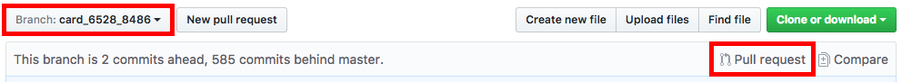
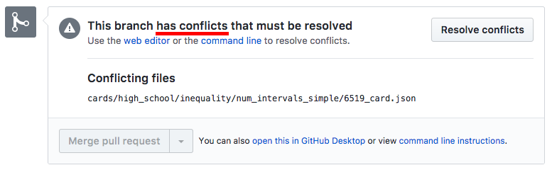
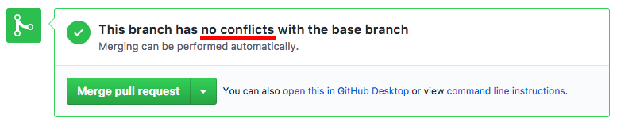
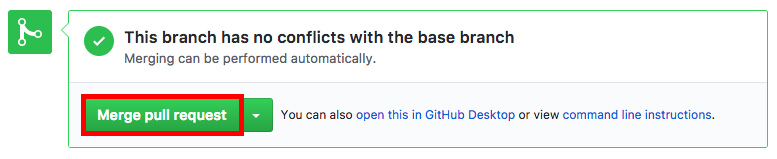

# Git Workflow

Автор: [Руслан Хуснетдинов](https://github.com/ruslankhh).

## Содержание

- [Предисловие](#Предисловие)
    - [Цель](#Цель)
    - [Профит](#Профит)
- [Инструкция](#Инструкция)
    - [1. Подтягиваем последние изменения в master](#1-Подтягиваем-последние-изменения-в-master)
    - [2. Создаем ветку](#2-Создаем-ветку)
    - [3. Работаем в ветке](#3-Работаем-в-ветке)
    - [4. Создаём PR на GitHub-е](#4-Создаём-pr-на-github-е)
    - [5. Review](#5-review)
    - [6. Проверяем наличие конфликтов на GitHub-е](#6-Проверяем-наличие-конфликтов-на-github-е)
    - [7. Мержим PR на GitHub-е](#7-Мержим-pr-на-github-е)
    - [8. Удаляем ветку на GitHub-е](#8-Удаляем-ветку-на-github-е)
    - [9. Проверяем карточку в CMS](#9-Проверяем-карточку-в-cms)
- [Вместо обычного терминала MacOS можно использовать iTerm2](Вместо-обычного-терминала-MacOS-можно-использовать-iTerm2)
  - [ALIASES](#aliases)
- [Changelog](#changelog)

## Предисловие

### Цель

Удобная работа с Git. Использование всех его возможностей.

### Профит

- удобная работа с Git;
- чистый master;
- удобное возвращение до нужно коммита (`git reset/revert <commit>`)
- review кода;
- не нужно ждать окончания сборки во время разработки;

## Инструкция

### 1. Подтягиваем последние изменения в master

```bash
# on branch master
git pull --rebase
```

### 2. Создаем ветку

1. Определяем имя ветки

    Название ветки для конкретной карточки и скрипта должно быть вида:

    - `card_<card_id>_<script_id>` — для новой карточки;

    - `card_<card_id>_<script_id>_fix` — для фикса карточки;

    - `card_<card_id>_<script_id>_new` — для доработки карточки;

    Последние два пункта для случаев, когда сложность задачи больше minor (уточнить у тимлида).

2. Проверяем, есть ли уже такая ветка

    ```bash
    # on branch master
    git checkout <branch name>
    ```

    - Если ветка есть, то git скачает её и перейдет в неё.

    - Если ветки нет, то git выдаст ошибку.

3. Создаём ветку, если такой ветки нет, из master-а

    ```bash
    # on branch master
    git checkout -b <branch name>
    ```

### 3. Работаем в ветке

1. Вносим изменения

    ```bash
    # on branch <branch name>
    git status
    git add .
    git commit -m "c#<card_id>#<chunk_number> <message>"
    ```

2. Пушим ветку в origin

    ```bash
    # on branch <branch name>
    git push origin <branch name>
    ```

### 4. Создаём PR на GitHub-е

PR — Pull Request. В качестве ревьювера назначаем ответственное по релизу лицо (тимлид или кто-то другой). Можно добавить комментарии.



### 5. Review

Ревьювер проверяет, оставляет комментарии и ставит статус для PR в зависимости от результата проверки (Changes requested/Approved). В зависимости от результата проверки выполняем следующие действия:

- **Changes requested**: вносим изменения и уведомляем ревьювера об окончании.

    

- **Approved**: идём дальше.

    

### 6. Проверяем наличие конфликтов на GitHub-е

- Если есть конфликты: исправляем их.

  

  1. Мержим master в нашу ветку:

      ```bash
      # on branch <branch name>
      git pull origin master
      ```

  2. Устраняем конфликты в редакторе.

  3. Проверяем карточку на localhost-е:

      ```bash
      open http://localhost:4567/lessons/<card_id>
      ```

      - Если ошибки есть: исправляем их.

      - Если ошибок нет: идём дальше.

  4. Пушим изменения в origin:

      ```bash
      git add .
      git commit
      git push origin <branch name>
      ```
- Если нет конфликтов: идём дальше.

    

### 7. Мержим PR на GitHub-е



### 8. Удаляем ветку на GitHub-е

### 9. Проверяем карточку в CMS

Добавил: [Грошев Георгий]().
---

# Вместо обычного терминала MacOS можно использовать iTerm2.
* [iTerm2](https://www.iterm2.com/)
* [Темы](https://github.com/robbyrussell/oh-my-zsh/wiki/Themes)
* [Настройки](https://medium.com/@Clovis_app/configuration-of-a-beautiful-efficient-terminal-and-prompt-on-osx-in-7-minutes-827c29391961)

После установки нужно добавить строчку в `~/.gitconfig`:
```
[oh-my-zsh]
  hide-status = 1
```

## ALIASES

|alias | column2|
|------- | -------|
|gup | 'git pull --rebase'|
|gupv | 'git pull --rebase -v’|
|gst | 'git status’|
|gp | 'git push’|
|gm | 'git merge’|
|gcm | 'git checkout master’|
|g | 'git'|
|ga | 'git add'|
|gaa | 'git add —all'|
|gcm | 'git checkout master'|

<details><summary>FULL</summary>

alias | column1
------- | -------
 g | 'git'
 ga | 'git add'
 gaa | 'git add --all'
 gapa | 'git add --patch'
 gau | 'git add --update'
 gap | 'git apply'
 gb | 'git branch'
 gba | 'git branch -a'
 gbd | 'git branch -d'
 gbda | 'git branch --no-color --merged | command grep -vE "^(\*|\s*(master|develop|dev)\s*$)" | command xargs -n 1 git branch -d'
 gbl | 'git blame -b -w'
 gbnm | 'git branch --no-merged'
 gbr | 'git branch --remote'
 gbs | 'git bisect'
 gbsb | 'git bisect bad'
 gbsg | 'git bisect good'
 gbsr | 'git bisect reset'
 gbss | 'git bisect start'
 gc | 'git commit -v'
 gc! | 'git commit -v --amend'
 gcn! | 'git commit -v --no-edit --amend'
 gca | 'git commit -v -a'
 gca! | 'git commit -v -a --amend'
 gcan! | 'git commit -v -a --no-edit --amend'
 gcans! | 'git commit -v -a -s --no-edit --amend'
 gcam | 'git commit -a -m'
 gcsm | 'git commit -s -m'
 gcb | 'git checkout -b'
 gcf | 'git config --list'
 gcl | 'git clone --recursive'
 gclean | 'git clean -fd'
 gpristine | 'git reset --hard && git clean -dfx'
 gcm | 'git checkout master'
 gcd | 'git checkout develop'
 gcmsg | 'git commit -m'
 gco | 'git checkout'
 gcount | 'git shortlog -sn'
 gcp | 'git cherry-pick'
 gcpa | 'git cherry-pick --abort'
 gcpc | 'git cherry-pick --continue'
 gcs | 'git commit -S'
 gd | 'git diff'
 gdca | 'git diff --cached'
 gdcw | 'git diff --cached --word-diff'
 gdct | 'git describe --tags `git rev-list --tags --max-count=1`'
 gdt | 'git diff-tree --no-commit-id --name-only -r'
 gdw | 'git diff --word-diff'
 gg | 'git gui citool'
 gga | 'git gui citool --amend'
 gl | 'git pull'
 glg | 'git log --stat'
 glgp | 'git log --stat -p'
 glgg | 'git log --graph'
 glgga | 'git log --graph --decorate --all'
 glgm | 'git log --graph --max-count=10'
 glo | 'git log --oneline --decorate'
 glol | "git log --graph --pretty='%Cred%h%Creset -%C(yellow)%d%Creset %s %Cgreen(%cr) %C(bold blue)<%an>%Creset' --abbrev-commit"
 glola | "git log --graph --pretty='%Cred%h%Creset -%C(yellow)%d%Creset %s %Cgreen(%cr) %C(bold blue)<%an>%Creset' --abbrev-commit --all"
 glog | 'git log --oneline --decorate --graph'
 gloga | 'git log --oneline --decorate --graph --all'
 glp | "_git_log_prettily"
 gm | 'git merge'
 gmom | 'git merge origin/master'
 gmt | 'git mergetool --no-prompt'
 gmtvim | 'git mergetool --no-prompt --tool=vimdiff'
 gmum | 'git merge upstream/master'
 gma | 'git merge --abort'
 gp | 'git push'
 gpd | 'git push --dry-run'
 gpoat | 'git push origin --all && git push origin --tags'
 gpu | 'git push upstream'
 gpv | 'git push -v'
 gr | 'git remote'
 gra | 'git remote add'
 grb | 'git rebase'
 grba | 'git rebase --abort'
 grbc | 'git rebase --continue'
 grbi | 'git rebase -i'
 grbm | 'git rebase master'
 grbs | 'git rebase --skip'
 grh | 'git reset HEAD'
 grhh | 'git reset HEAD --hard'
 grmv | 'git remote rename'
 grrm | 'git remote remove'
 grset | 'git remote set-url'
 grt | 'cd $(git rev-parse --show-toplevel || echo ".")'
 gru | 'git reset --'
 grup | 'git remote update'
 grv | 'git remote -v'
 gsb | 'git status -sb'
 gsd | 'git svn dcommit'
 gsi | 'git submodule init'
 gsps | 'git show --pretty=short --show-signature'
 gsr | 'git svn rebase'
 gss | 'git status -s'
 gst | 'git status'
 gsta | 'git stash save'
 gstaa | 'git stash apply'
 gstc | 'git stash clear'
 gstd | 'git stash drop'
 gstl | 'git stash list'
 gstp | 'git stash pop'
 gsts | 'git stash show --text'
 gsu | 'git submodule update'
 gts | 'git tag -s'
 gtv | 'git tag | sort -V'
 gunignore | 'git update-index --no-assume-unchanged'
 gunwip | 'git log -n 1 | grep -q -c "\-\-wip\-\-" && git reset HEAD~1'
 gup | 'git pull --rebase'
 gupv | 'git pull --rebase -v'
 glum | 'git pull upstream master'
 gwch | 'git whatchanged -p --abbrev-commit --pretty=medium'
 gwip | 'git add -A; git rm $(git ls-files --deleted) 2> /dev/null; git commit --no-verify -m "--wip-- [skip ci]"'

</details>

# Changelog